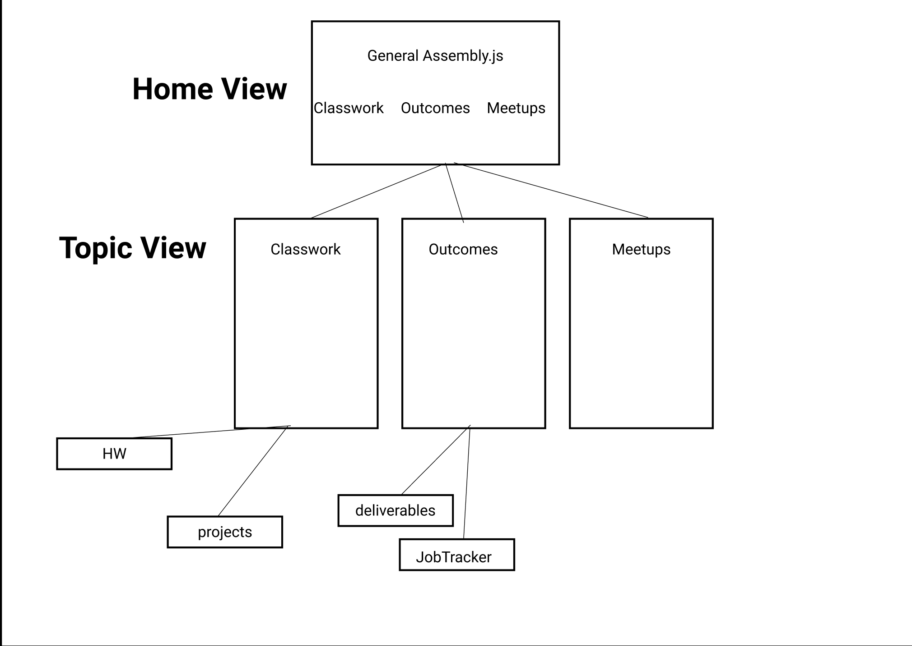
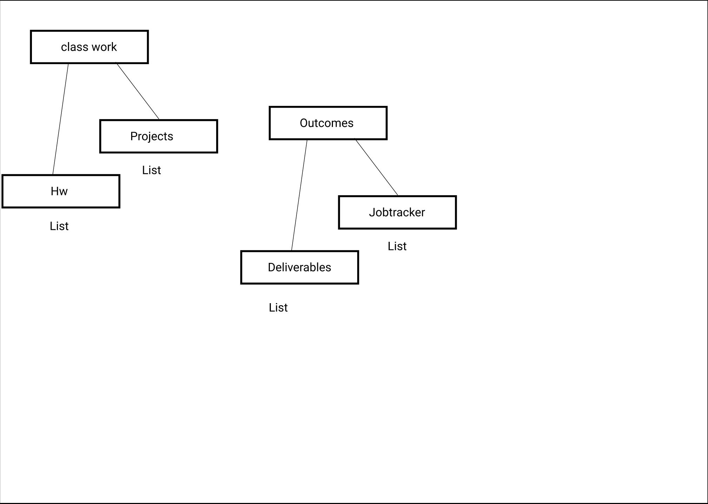

# General Assembly to-do App

https://gadue.herokuapp.com/

Planning Board: https://trello.com/b/l6KyCWVb/ga-to-do-list

# Here are my Screenshots of my wireframe and ERD

# Problem

    This app is designed as as a separate application from General assembly's main website. the purpose
of this app is for current GA students and graduated GA students to track Assignments, projects and all of their 
career materials, through various todo lists. the app also offers other outside resources that include links to slack.com for staying
connected with your fellow GA peers and meetup.com to keep up with any events and talks that a student may be interested in. this app also aims to give a mobile friendly approach that lets GA students know what they need to get, done and also manage their time.

# Project Overview

This project is an MVP for a Web/mobile app for General Assembly where there are todo list items for assignments, job materials, and meetups for GA students. this project uses the MVC architecture with Mongodb, Express, React and Node.js. setting up the initals build of the project was not to difficult, as far as the models and routes. I did find trouble when setting up the functionality and views in react. Though I covered most of the main funtionality and style of the app, there are still some kinks that I plan to work on, such fixing the bootstrap table in all of the todo list views, also giving the select form buttons specific functionality in relation to the data that is being used. i would also like to finish the styling of the individual edit forms for each todo list item.

